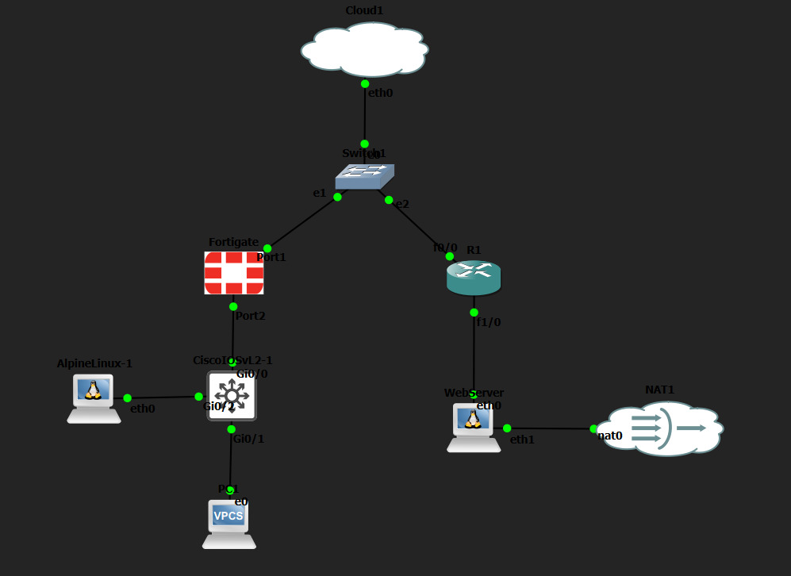
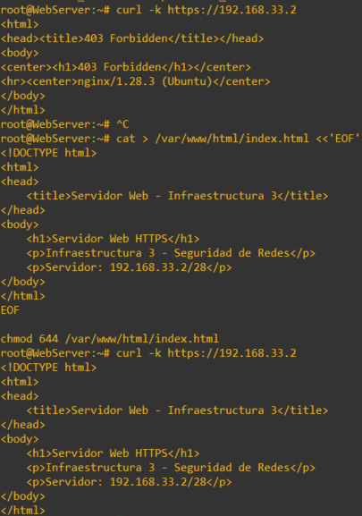
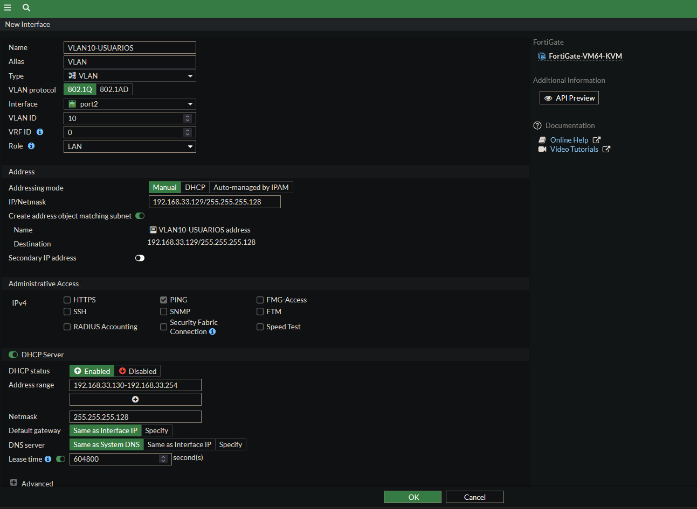
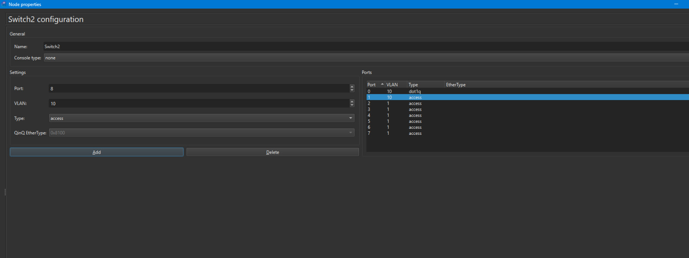
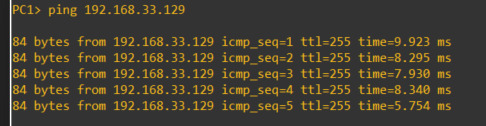
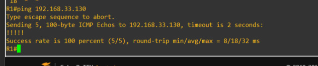
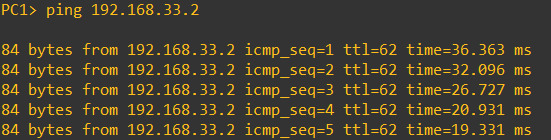
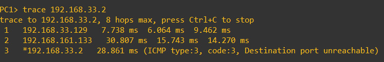
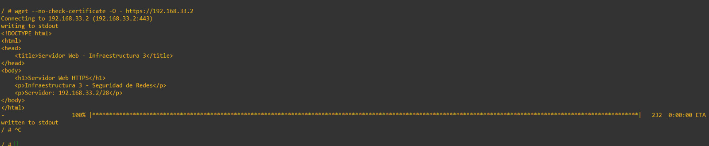
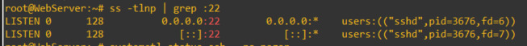

---

##  Información del estudiante

- **Estudiante:** Albert Morel
- **Matrícula:** 2025-0833
- **Asignatura:** Seguridad de Redes
- **Práctica:** Infraestructura 3
- **Plataforma:** GNS3

---

##  Propósito del laboratorio

El propósito de este laboratorio es implementar una infraestructura de red segmentada y protegida mediante un firewall FortiGate, utilizando una VLAN para la red de usuarios, direccionamiento dinámico mediante DHCP y un servidor con servicios HTTPS y SSH.

La infraestructura fue diseñada para permitir que los usuarios accedan al servidor Web mediante HTTPS sin necesidad de utilizar una VPN. Adicionalmente, se realizó la configuración de SSL-VPN en FortiGate para proporcionar acceso remoto seguro mediante SSH.

---

##  Objetivos

- Implementar un firewall FortiGate como dispositivo principal de seguridad.
- Configurar una red de usuarios utilizando VLAN 10.
- Proporcionar direccionamiento automático mediante DHCP.
- Integrar dispositivos Cisco dentro de la infraestructura.
- Implementar enrutamiento entre las diferentes redes.
- Configurar un WebServer dentro de una red `/28`.
- Habilitar HTTPS en el WebServer.
- Habilitar SSH en el WebServer.
- Permitir acceso HTTPS al servidor desde la red de usuarios.
- Configurar SSL-VPN en FortiGate.
- Verificar la conectividad mediante ping y traceroute.

---

## Topología

La infraestructura fue implementada en GNS3 utilizando FortiGate, dispositivos Cisco y sistemas Linux.



### Dispositivos principales

- FortiGate VM64-KVM
- Router Cisco R1
- Switch Cisco IOSvL2
- PC1 (VPCS)
- Alpine Linux
- WebServer Linux
- Cloud/ISP
- NAT auxiliar para el WebServer

---

## Direccionamiento IP

| Elemento | Dirección / Red | Función |
|---|---|---|
| FortiGate port1 | `192.168.161.132/24` | Conexión externa |
| R1 Fa0/0 | `192.168.161.133/24` | Enlace hacia red externa |
| VLAN 10 Usuarios | `192.168.33.128/25` | Red de usuarios |
| FortiGate VLAN 10 | `192.168.33.129/25` | Gateway de usuarios |
| PC1 | DHCP | Cliente VLAN 10 |
| WebServer | `192.168.33.2/28` | Servidor HTTPS/SSH |
| R1 Fa1/0 | `192.168.33.1/28` | Gateway del WebServer |
| SSL-VPN Pool | `10.10.20.10 - 10.10.20.20` | Clientes VPN |

---

# ⚙️ Implementación

## 1. WebServer

El servidor utiliza la dirección:

`192.168.33.2/28`

Se habilitaron los servicios:

- HTTPS — TCP/443
- SSH — TCP/22

El servicio HTTPS fue configurado correctamente y responde a las solicitudes de los clientes.



---

## 2. VLAN 10 y DHCP

La red de usuarios fue segmentada utilizando **VLAN 10**.

La interfaz correspondiente en FortiGate utiliza:

`192.168.33.129/25`

FortiGate funciona como gateway y servidor DHCP para los clientes pertenecientes a esta VLAN.



---

## 3. Switch Cisco

El switch Cisco IOSvL2 fue configurado para transportar la VLAN 10.

Se utilizaron interfaces de acceso para los clientes y un enlace trunk para transportar la VLAN hacia FortiGate.



La configuración completa se encuentra disponible en:

`running-configs/Switch-running-config.txt`

---

## 4. Asignación DHCP al cliente

PC1 obtiene automáticamente su direccionamiento desde el servicio DHCP configurado en FortiGate.


Esto confirma que el cliente pertenece correctamente a la red de usuarios.

---

## 5. Prueba hacia el gateway

Se comprobó la comunicación entre PC1 y el gateway de VLAN 10.



La respuesta confirma la comunicación entre el cliente y FortiGate.

---

## 6. Enrutamiento hacia el WebServer

Se configuraron las rutas necesarias para permitir comunicación entre la red de usuarios y la red del servidor.


El router R1 participa en el enrutamiento entre la infraestructura y la red `/28` del WebServer.

Su configuración completa está disponible en:

`running-configs/R1-running-config.txt`

---

## 7. Políticas de FortiGate

Se configuraron políticas de firewall para controlar el tráfico entre la VLAN de usuarios y el WebServer.


La configuración de FortiGate fue respaldada y se encuentra disponible en:

`running-configs/FortiGate-config.conf`

---

#  Pruebas de funcionamiento

## 8. Conectividad R1 → PC1

Se comprobó la comunicación entre el router y el cliente perteneciente a VLAN 10.



---

## 9. Conectividad PC1 → WebServer

Desde PC1 se realizó ping hacia:

`192.168.33.2`



La respuesta confirma que existe comunicación entre la red de usuarios y el servidor.

---

## 10. Traceroute hacia el WebServer

También se realizó traceroute desde PC1 hacia:

`192.168.33.2`



La prueba permite observar el recorrido del tráfico desde la VLAN de usuarios hasta la red del servidor.

---

## 11. HTTPS sin VPN

Uno de los objetivos principales consiste en permitir que el usuario pueda acceder al WebServer mediante HTTPS sin utilizar la VPN.

La prueba fue realizada desde Alpine Linux mediante:

```bash
wget --no-check-certificate -O - https://192.168.33.2
```

El servidor respondió correctamente mostrando el contenido de la página Web.



**Resultado:** acceso HTTPS sin VPN funcionando correctamente.

---

## 12. Servicio SSH

El WebServer tiene habilitado el servicio SSH mediante TCP/22.

La verificación del servicio muestra `sshd` escuchando en todas las interfaces:

```bash
ss -tlnp | grep :22
```



---

## SSL-VPN

Se realizó la configuración de SSL-VPN en FortiGate para proporcionar acceso remoto seguro.

### Parámetros principales

- **Interfaz:** port1
- **Puerto:** TCP/10443
- **Pool:** `SSLVPN_POOL`
- **Rango:** `10.10.20.10 - 10.10.20.20`
- **Grupo:** `SSLVPN_Users`
- **Portal:** `full-access`
- **Destino:** WebServer `192.168.33.2`
- **Servicio autorizado:** SSH

También fueron configuradas las rutas de retorno necesarias hacia la red VPN.

> La configuración completa del firewall está disponible en `running-configs/FortiGate-config.conf`.

---

# Archivos del repositorio

## Running-Configs

Las configuraciones de los dispositivos se encuentran en:

`running-configs/`

Incluyendo:

- `R1-running-config.txt`
- `Switch-running-config.txt`
- `FortiGate-config.conf`

## Scripts y comandos

Los comandos utilizados para la configuración y comprobación del WebServer se encuentran en:

`scripts/WebServer-config.txt`

## Evidencias

Las capturas de las configuraciones y pruebas están disponibles en:

`imagenes/`

## Diagrama

El diagrama de la infraestructura se encuentra en:

`diagramas/Topologia_Infraestructura3.png`

---

# Resultados

Durante las pruebas se comprobó:

- Funcionamiento de VLAN 10.
- Asignación automática mediante DHCP.
- Comunicación PC1 → Gateway.
- Comunicación entre R1 y la red de usuarios.
- Comunicación PC1 → WebServer.
- Traceroute desde PC1 hasta el WebServer.
- Funcionamiento del servicio HTTPS.
- Acceso HTTPS sin VPN.
- Funcionamiento del servicio SSH.
- Configuración de SSL-VPN en FortiGate.
- Políticas de seguridad y rutas necesarias para la infraestructura.

---

# Conclusión

La práctica permitió implementar una infraestructura segmentada y protegida utilizando FortiGate, dispositivos Cisco y sistemas Linux.

Mediante VLAN 10 y DHCP se estableció una red independiente para los usuarios. El enrutamiento y las políticas configuradas permiten la comunicación controlada con el WebServer, donde se habilitaron los servicios HTTPS y SSH.

Las pruebas de ping, traceroute y acceso HTTPS permitieron comprobar el funcionamiento de la infraestructura y la comunicación entre sus diferentes componentes.

Finalmente, se realizó la configuración de SSL-VPN en FortiGate como mecanismo de acceso remoto seguro hacia los recursos internos.
